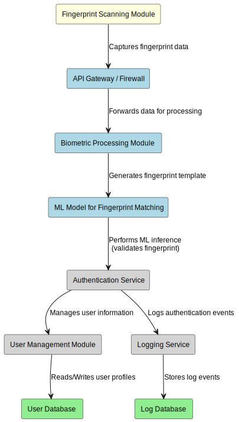
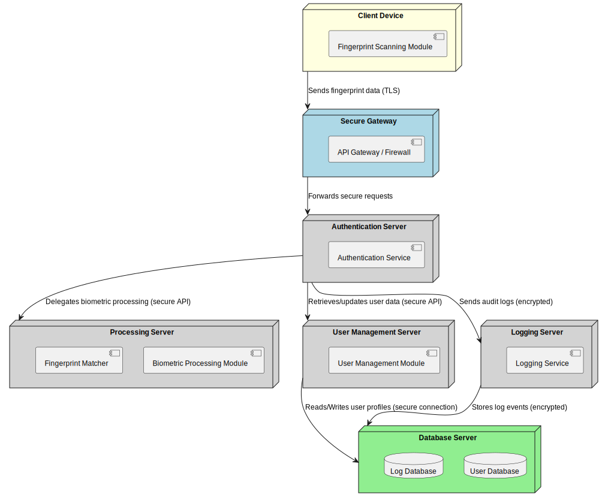

# Fingerprint Biometric Authentication System - UML Diagrams

This document provides a high-level overview of the system architecture using two key UML diagrams: the **Component Diagram** and the **Deployment Diagram**. These diagrams illustrate both the modular structure of the system and its physical deployment within a secure and distributed environment.

## Component Diagram

  

The Component Diagram outlines the primary modules within the system along with their specific functions and interactions:

- **Fingerprint Scanning Module:** Captures raw fingerprint data from the user.
- **API Gateway / Firewall:** Secures incoming requests and forwards them to internal components.
- **Biometric Processing Module:** Processes raw fingerprint data to generate a usable fingerprint template.
- **Fingerprint Matcher:** Compares the processed fingerprint template against stored templates to validate identity.
- **Authentication Service:** Manages the authentication process by coordinating between the matcher and user management, ensuring secure verification.
- **User Management Module:** Handles user registration and profile management, linking users to their biometric data.
- **Logging Service:** Records authentication events and system activities for auditing and troubleshooting.
- **User Database:** Stores user profiles and fingerprint templates.
- **Log Database:** Stores audit logs and system events securely.

This modular design supports scalability, maintainability, and enhanced security by clearly separating concerns and isolating sensitive functionalities.

## Deployment Diagram

  

The Deployment Diagram illustrates how the system’s components are physically distributed across different hardware nodes in a top-to-bottom layout:

- **Client Device:** The endpoint where fingerprint data is captured via the Fingerprint Scanning Module.
- **Secure Gateway:** Acts as an entry point that protects and filters incoming requests through the API Gateway / Firewall.
- **Authentication Server:** Hosts the Authentication Service, which coordinates secure requests and manages user authentication.
- **Processing Server:** Houses the Biometric Processing Module and Fingerprint Matcher to handle biometric data processing and validation.
- **User Management Server:** Hosts the User Management Module for handling user data operations.
- **Logging Server:** Contains the Logging Service, which securely logs system events.
- **Database Server:** Contains two distinct databases:
  - **User Database:** For storing user profiles and biometric data.
  - **Log Database:** For storing audit logs and system events.

Secure communication channels (e.g., TLS encryption) are implemented between nodes to protect data in transit. This layered deployment model ensures that sensitive components are isolated, reducing the risk of lateral movement in case of a security breach.

## Further Considerations

The system architecture emphasizes:
- **Separation of Concerns:** Isolating scanning, processing, matching, authentication, and logging functionalities.
- **Enhanced Security:** Implementing secure gateways, encrypted communications, and isolated components.
- **Scalability:** Enabling independent scaling and maintenance of modular components.
- **Audit and Compliance:** Utilizing dedicated logging and log storage for robust audit trails and adherence to security standards.

These diagrams serve as a blueprint for designing a robust, secure, and scalable fingerprint biometric authentication system. Feel free to modify and extend these diagrams to align with evolving security policies, project requirements, and infrastructure needs.
