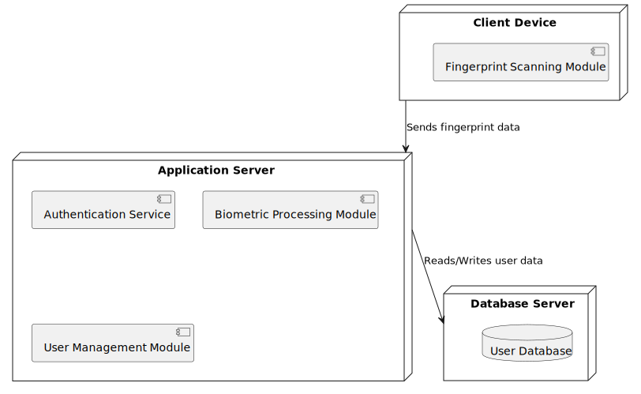

# Fingerprint Biometric Authentication System - UML Diagrams

This document provides a high-level overview of the system architecture through two key UML diagrams: the Component Diagram and the Deployment Diagram. These diagrams are intended to illustrate both the modular structure of the system and its physical deployment in a distributed environment.

## Component Diagram

  

The Component Diagram outlines the major modules within the system and their interactions. Key components include:

- **Fingerprint Scanning Module:** Captures raw fingerprint data from the user.
- **Biometric Processing:** Converts the raw data into a fingerprint template suitable for comparison.
- **Authentication Service:** Validates the fingerprint template against stored data to authenticate users.
- **User Management:** Handles user registration and profile management, linking users to their biometric data.
- **Database:** Stores user profiles, fingerprint templates, and other related information.

This modular design supports scalability and simplifies maintenance by ensuring each component focuses on a specific aspect of the system’s functionality.

## Deployment Diagram

  

The Deployment Diagram illustrates how the system’s components are distributed across different hardware nodes. The main nodes are:

- **Client Device:** The endpoint where the fingerprint is captured by the Fingerprint Scanning Module.
- **Application Server:** Hosts the core services, including the Authentication Service, Biometric Processing, and User Management. This server processes the fingerprint data received from client devices.
- **Database Server:** Dedicated to storing persistent data such as user profiles and fingerprint templates.

In this setup, the Client Device sends captured fingerprint data to the Application Server, which then communicates with the Database Server for data retrieval or updates, ensuring a streamlined and efficient authentication process.

## Further Considerations

These diagrams serve as a blueprint for designing a robust, scalable fingerprint biometric authentication system. They emphasize the separation of concerns between data capture, processing, authentication, and storage, which facilitates future enhancements such as additional security measures, load balancing, and improved fault tolerance.

Feel free to adapt and extend these diagrams to better align with your specific project requirements and deployment environment.
