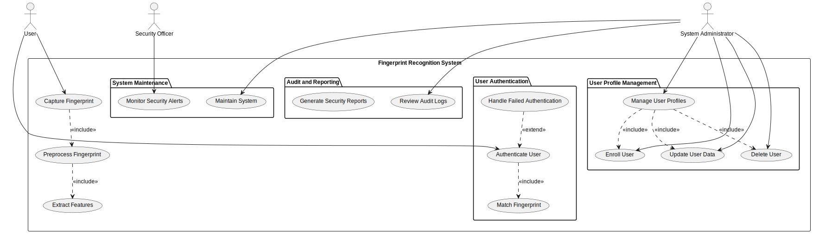

# Fingerprint Biometric Authentication System - UML Diagrams Documentation

This document provides a comprehensive overview of the various UML diagrams that describe the functionality, system behavior, interactions, and process flows for the Fingerprint Biometric Authentication System. The diagrams included in this documentation are:

- **Use Case Diagram:** Captures the functional requirements and interactions between system actors and key use cases.
- **State Diagram:** Shows the system’s behavior by detailing states for both the authentication and enrollment processes, including an escape clause for repeated authentication attempts.
- **Sequence Diagram:** Illustrates the dynamic interactions between system components during the authentication process, including a loop for a limited number of fingerprint capture attempts.
- **Activity Diagram:** Provides an overview of the overall system algorithm, splitting the flows for authentication and enrollment side by side, with an escape clause to prevent infinite loops.

---

## 1. Use Case Diagram

  

### Overview

The Use Case Diagram outlines the primary interactions and use cases of the system:

- **User:** Initiates fingerprint capture and authentication.
- **System Administrator:** Manages user profiles, including enrollment, update, and deletion of user data.
- **Security Officer:** Monitors system security alerts and oversees system maintenance.

### Detailed Use Cases

#### Authentication Use Cases
- **Capture Fingerprint:** The user initiates the fingerprint scanning process.
- **Preprocess Fingerprint:** The captured fingerprint image is enhanced to reduce noise.
- **Extract Features:** Distinct features from the fingerprint are extracted.
- **Fingerprint Matching:** The system compares the extracted features against stored fingerprint templates to validate the user’s identity.
- **Reattempt Authentication:** If no match is found, the system prompts the user to re-capture their fingerprint and try again.

#### Enrollment Use Cases
- **Enroll User:** The system administrator enrolls a new user by capturing their fingerprint.
- **Generate Fingerprint Template:** Following processing, a new fingerprint template is created and stored for future authentication.

#### User Profile Management
- **Manage User Profiles:** The system administrator can manage user profiles (enroll new users, update user data, and delete users).

#### Audit and Maintenance Use Cases
- **Review Audit Logs:** The system administrator reviews authentication events and system logs.
- **Monitor Security Alerts:** The security officer monitors system alerts.
- **Generate Security Reports:** The system generates periodic reports for audit and compliance.

---

## 2. State Diagram

  

### Overview

The State Diagram models the dynamic behavior of the Fingerprint Biometric Authentication System by illustrating the transitions between various states as the system responds to user interactions. The diagram is organized into two main nested flows: the **Authentication Process** and the **Enrollment Process**. These flows capture both normal operations and exceptional conditions, ensuring that the system robustly handles both successful outcomes and error conditions.

- **Authentication Process:**  
  - **Initiation:**  
    The process begins when a user initiates authentication, transitioning the system from the Idle state to the Authentication Process.
  - **Fingerprint Capture:**  
    The system activates the fingerprint sensor to capture the user's fingerprint. This state represents the initial data acquisition stage.
  - **Image Preprocessing:**  
    After capture, the raw fingerprint image is enhanced to reduce noise and normalize the data, ensuring that the image is in an optimal form for further analysis.
  - **Feature Extraction:**  
    The enhanced image is analyzed to extract distinct fingerprint features. This step converts the image into a feature vector used for matching.
  - **Fingerprint Matching:**  
    The extracted features are compared against stored fingerprint templates in the system's database.  
    - If a matching template is found, the system transitions to an **Authenticated** state, confirming the user's identity.  
    - If no match is found, the system enters a **Failed** state.
  - **Error Handling & Retry Loop:**  
    In the **Failed** state, the system allows the user to reattempt authentication:
    - If the number of attempts is below a defined maximum (escape clause), the system transitions to a **Retry** state, prompting the user to re-capture the fingerprint.
    - If the maximum number of attempts is reached, the system transitions to an **AuthFailure** state, terminating the authentication process to prevent an infinite retry loop.

- **Enrollment Process:**  
  - **Initiation by Administrator:**  
    The enrollment process is initiated by an administrator, ensuring that only authorized personnel can add new users.
  - **Fingerprint Capture for Enrollment:**  
    The system captures the fingerprint of the new user, specifically for enrollment purposes.
  - **Image Preprocessing & Feature Extraction:**  
    Similar to the authentication process, the captured fingerprint undergoes preprocessing and feature extraction to standardize the data.
  - **Template Generation:**  
    A new fingerprint template is generated based on the extracted features. This template uniquely represents the new user's biometric data.
  - **Completion:**  
    The process concludes when the new template is successfully generated and stored in the database, completing the enrollment of the user.

---

## 3. Sequence Diagram

  

### Overview

The Sequence Diagram illustrates the dynamic interactions between various system components during the authentication process. It visually represents the flow of messages among system objects, ensuring that each step in the process—from capturing the fingerprint to authenticating the user—is clearly defined and executed in sequence. The key elements and their roles in the diagram include:

- **User:**  
  Initiates the authentication process by triggering the fingerprint capture. The user’s actions start the workflow and provide the necessary input for biometric verification.

- **RecognitionSystem:**  
  Acts as the central orchestrator of the authentication process. It coordinates interactions among various components, handling the overall logic of authentication including error checking, looping for reattempts, and final decision-making based on the outcomes of the fingerprint matching.

- **FingerprintSensor:**  
  Responsible for capturing the raw fingerprint image from the user. This component interacts directly with the hardware and provides the captured fingerprint to the RecognitionSystem.

- **Preprocessor:**  
  Enhances and normalizes the captured fingerprint image by reducing noise and improving the image quality. This step is critical to ensure that the subsequent feature extraction is performed on a clean, optimized image.

- **FeatureExtractor:**  
  Processes the preprocessed fingerprint image to extract key biometric features. The extracted features are then used as input for the matching process.

- **NeuralNetworkModel:**  
  Utilizes a machine learning algorithm (such as a Siamese network) to predict the similarity between the extracted features and stored fingerprint templates. It generates a matching score that helps determine whether the captured fingerprint corresponds to a registered user.

- **Database:**  
  Searches for and retrieves the user profile associated with a matching fingerprint template. It serves as the repository for all stored user data and biometric templates.

- **Logger (Optional):**  
  Captures and records key events during the authentication process. Logging may include events such as fingerprint capture, image preprocessing, feature extraction, and the outcome of the matching process. This can be invaluable for debugging, auditing, and monitoring system performance.

### Additional Flow Details

- **Loop for Limited Attempts:**  
  The diagram includes a loop that restricts the number of fingerprint capture attempts. This is implemented to prevent the system from getting stuck in an infinite retry loop if a fingerprint is not recognized. After each unsuccessful attempt, the system prompts the user to try again until either a match is found or the maximum number of allowed attempts is reached.

- **Decision Points and Error Handling:**  
  The sequence includes alternative flows (branches) where, if no matching user is found, the system logs the event and prompts the user for another attempt. Once the limit is reached, the process exits with an authentication failure response.

---

## 4. Activity Diagram

  

### Overview

The Activity Diagram provides a high-level view of the overall system algorithm for the Fingerprint Biometric Authentication System. It starts with a vertical main flow where the user is presented with a menu to select an option. Based on the user's choice, the workflow splits into two parallel branches representing the two primary functionalities: Authentication and Enrollment.

- **Authentication Flow:**  
  - **Capture Fingerprint:**  
    The process begins when the user's fingerprint is captured via the sensor.
  - **Preprocess Image:**  
    The captured fingerprint image is enhanced to reduce noise and improve quality.
  - **Extract Features:**  
    Distinct biometric features are extracted from the preprocessed image, converting it into a feature vector for comparison.
  - **Match Fingerprint:**  
    The extracted features are then compared against stored fingerprint templates to verify the user's identity.
  - **Retry Loop with Escape Clause:**  
    If the fingerprint is not recognized, the system enters a retry loop, prompting the user to reattempt the authentication process. This loop is controlled by an escape clause that limits the number of attempts, ensuring that the process terminates with an authentication failure if the maximum number of retries is exceeded.
  - **Authentication Outcome:**  
    - **Success:** If a match is found within the allowed attempts, the user is successfully authenticated.
    - **Failure:** If the maximum number of attempts is reached without a match, the authentication process ends in failure.

- **Enrollment Flow:**  
  - **Initiate Enrollment:**  
    The process is initiated by an administrator selecting the enrollment option.
  - **Capture Fingerprint for Enrollment:**  
    The new user's fingerprint is captured.
  - **Preprocess Enrollment Image:**  
    Similar to the authentication flow, the captured fingerprint image is enhanced.
  - **Extract Features for Enrollment:**  
    The system extracts biometric features from the enhanced enrollment image.
  - **Generate Fingerprint Template:**  
    A new fingerprint template is generated from the extracted features.
  - **Store User Data:**  
    The newly generated template and associated user data are stored in the database.
  - **Enrollment Completion:**  
    The process concludes with confirmation that the user has been successfully enrolled.

