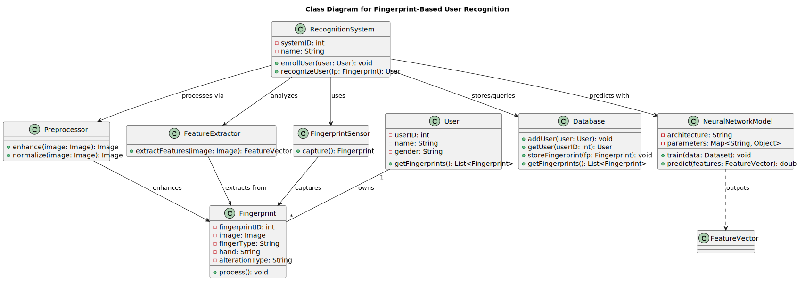

  <h1>UML Class Diagram for Fingerprint-Based User Recognition</h1>

This document provides a detailed description of the UML Class Diagram for a <strong>Fingerprint-Based User Recognition System</strong>. The diagram models the core components and their interactions required to enroll and recognize users based on fingerprint data, incorporating key modules for capturing, processing, and matching fingerprints.

## Overview

The class diagram captures the end-to-end workflow of fingerprint-based recognition by illustrating how each component collaborates within the system:

1. **Fingerprint Acquisition** – The **FingerprintSensor** interfaces with scanning hardware to capture raw fingerprint images, ensuring accurate data collection at the front end.  
2. **Image Processing Pipeline** – Captured images flow through the **Preprocessor**, which enhances and normalizes them, and then through the **FeatureExtractor**, which distills each image into a concise **FeatureVector** representation.  
3. **Matching and Recognition** – A configurable **NeuralNetworkModel** (e.g., a Siamese network) receives feature vectors, performs similarity comparisons, and returns confidence scores used by the **RecognitionSystem** to identify or reject a user.  
4. **User Management** – The **RecognitionSystem** orchestrates both enrollment—adding new **User** instances and their **Fingerprint** templates to the **Database**—and recognition—querying stored templates to match incoming samples.  
5. **Persistence and Logging** – All user profiles and fingerprint records reside in the **Database**, while a **Logger** component captures authentication and enrollment events for auditability and troubleshooting.  

By clearly delineating each class’s responsibility—from hardware interaction to machine learning inference and data persistence—this diagram ensures a modular, maintainable, and extensible design for robust biometric authentication.

## Class Descriptions

### RecognitionSystem

The central orchestrator that manages both enrollment and recognition workflows.

**Attributes:**  
- `systemID: int` – Unique system identifier  
- `name: String` – System name  

**Key Methods:**  
- `enrollUser(user: User): void` – Enrolls a new user’s fingerprint  
- `recognizeUser(fp: Fingerprint): User` – Matches a fingerprint to a user  

### User

Represents an individual in the system, holding personal and biometric data.

**Attributes:**  
- `userID: int` – Unique user identifier  
- `name: String` – User’s name  
- `gender: String` – User’s gender  

**Key Method:**  
- `getFingerprints(): List<Fingerprint>` – Returns all fingerprint samples for this user  

### Fingerprint

Encapsulates a single fingerprint sample and its metadata.

**Attributes:**  
- `fingerprintID: int` – Unique fingerprint sample ID  
- `image: Image` – Raw fingerprint image  
- `fingerType: String` – e.g., “thumb”, “index”  
- `hand: String` – “Left” or “Right”  
- `alterationType: String` – e.g., “raw”, “enhanced”  

**Key Method:**  
- `process(): void` – Applies any per‑sample processing steps  

### FingerprintSensor

Interfaces with the physical scanner to capture raw fingerprint data.

**Key Method:**  
- `capture(): Fingerprint` – Reads a fingerprint and returns a `Fingerprint` object  

### Preprocessor

Performs image enhancement and normalization on captured fingerprints.

**Key Methods:**  
- `enhance(image: Image): Image` – Improves image clarity  
- `normalize(image: Image): Image` – Standardizes image format  

### FeatureExtractor

Extracts a numerical feature vector from a preprocessed fingerprint image.

**Key Method:**  
- `extractFeatures(image: Image): FeatureVector` – Returns the fingerprint’s feature vector  

### NeuralNetworkModel

Represents the ML model used to compare feature vectors for recognition.

**Attributes:**  
- `architecture: String` – Model architecture description  
- `parameters: Map<String, Object>` – Hyperparameters and learned weights  

**Key Methods:**  
- `train(data: Dataset): void` – Trains the model on labeled data  
- `predict(features: FeatureVector): double[]` – Outputs similarity scores or classification  

### Database

Stores users and fingerprint records, providing query capabilities.

**Key Methods:**  
- `addUser(user: User): void` – Registers a new user  
- `getUser(userID: int): User` – Retrieves a user by ID  
- `storeFingerprint(fp: Fingerprint): void` – Saves a fingerprint sample  
- `getFingerprints(): List<Fingerprint>` – Retrieves all stored fingerprints  

## Class Relationships

- **RecognitionSystem** → **FingerprintSensor** : “uses”  
- **RecognitionSystem** → **Preprocessor** : “processes via”  
- **RecognitionSystem** → **FeatureExtractor** : “analyzes”  
- **RecognitionSystem** → **NeuralNetworkModel** : “predicts with”  
- **RecognitionSystem** → **Database** : “stores/queries”  
- **User** “1” — “*” **Fingerprint** : “owns”  
- **FingerprintSensor** → **Fingerprint** : “captures”  
- **Preprocessor** → **Fingerprint** : “enhances”  
- **FeatureExtractor** → **Fingerprint** : “extracts from”  
- **NeuralNetworkModel** ..> **FeatureVector** : “outputs”  

## Conclusion

This UML Class Diagram captures the end‑to‑end flow for enrolling and recognizing users via fingerprint biometrics. Each component’s responsibility and interactions are clearly defined, supporting a modular, maintainable, and extensible design.
